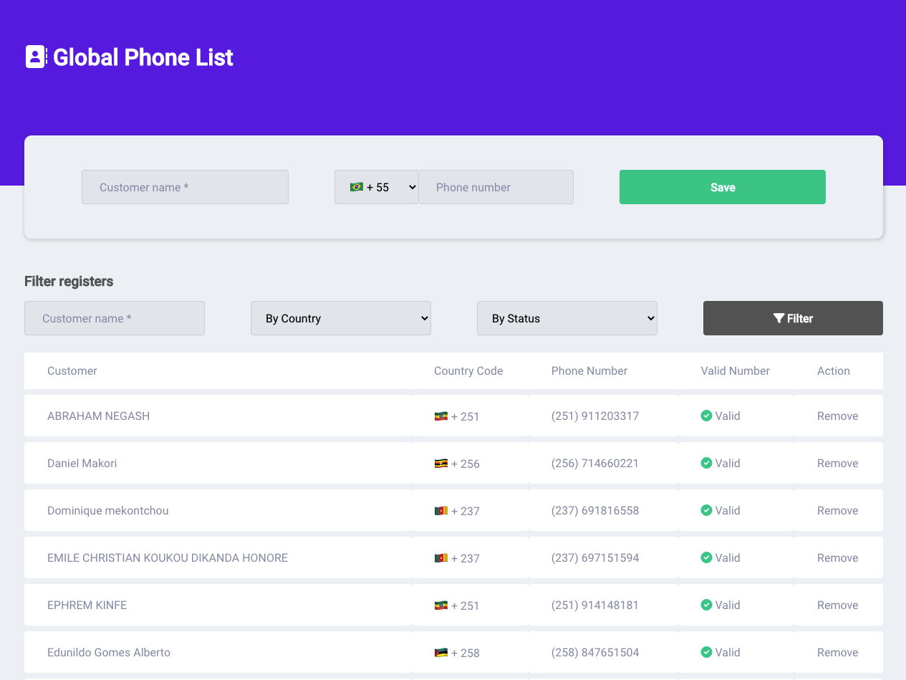
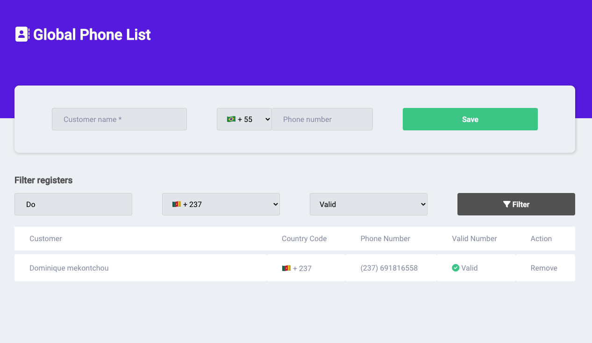

# Global Phone List
---

##### Description:
Global Phone List is a simple project to manage phone numbers. 
This is allow contact to be created and deleted, filtered by contact name,
Country code and phone number status (Valid or invalid)

## How to run?
1. Install SQLite3
```
Download at https://www.sqlite.org/index.html.
(If you use Linux or Mac OS X, probably, it is already installed)
To check if SQLite3 is installed, run sqlite --version.
```
2. Install all dependencies running
```
composer install
```
3. Run `php artisan serve` to start the server listening
4. Open at http://127.0.0.1:8000/


# Technologies
-----
Language: PHP 8
Database: Sqlite3
Framework/Main Components: Laravel (Latest)

# Testing
-----
Run `php artisan test` to test application
> Important note; Before running tests, you will need to run the seeder.

# Screenshots

#### New customer phone


#### Filtering customer phone


## Notes
-----
In this project, I choose Laravel as the Back-end framework. It was my choice because I am more familiar with it, and using it, we have lots of advantages as: ORM, Routes and others.
The structure choosen was MVC. In this case, I think I would be the best in this scenario.

I didn't use any front-end framework / lib as Bootstrap (UI frameowk) or even React/VueJS (JS Framework). That's because it was necessary, the project would have a bigger size.

As good practies, I used Dependency injection and Repository Pattern. 


# Questions?
-----
Contact me at: lucasgabrielhonorio@gmail.com
